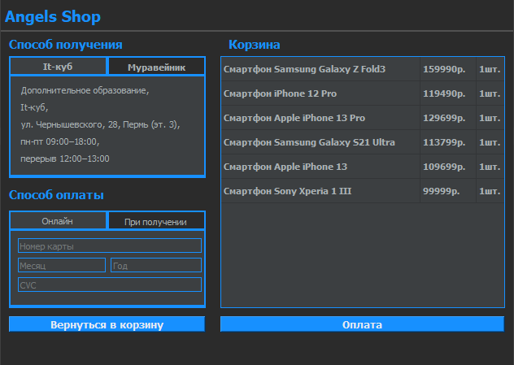

# Интернет магазин
## Автор проекта: Ханжин Александр
## Идеей проекта является создание оконного приложения (с помощью библиотека PyQt5), реализующего работу интернет магазина.
### Для запуска оконного приложения запускается файл entry.py. При запуске открывается меню авторизации и регистрации (класс Entry), на котором можно создать или зарегистрировать аккаунт. Ввод данных реализован с помощью QLineEdit, действия с помощью QPushButton. Помимо этого, на телефон и пароль должны быть корректными. Номер телефона должен иметь вид (+7 *** *** ** ** или 8 *** *** ** **). Пароль должен быть не более 20 символов. Все проверки реализуются с помощью try, except, raise. При регистрации данные пользователя заносятся в SQL таблицу. При регистрации происходит проверка совпадения данных пользователя с данными таблицы.
# 
### При нажатии кнопки авторизации и введенными корректными данными открывается новое окно, в котором пользователь может искать товары в SQL таблице, добавлять товары в корзину и переходить в корзину. Для ввода поисковых данных используется QLineEdit, для отображения данных из SQL таблицы используется QTableWidget, для добавления используется QPushButton. При попытке ввода данных в QLineEdit, происходит запрос к базе дынных и корректный вывод в таблицу QTableWidget. При нажатии кнопки добавления в корзину в выбранными элементами таблицы открывается диалоговое окно с подтверждением действий пользователя. Если товары для удаления не выделены об этом сообщается пользователю с помощью try, except, raise.
# 
### При нажатии кнопки перехода в корзину открывается окно корзины. В корзине пользователь может удалять данные из корзины, изменять их количество, при отсутствие таковых пользователю предлагается перейти на окно выбора товаров. При нажатии кнопки удаления открывается диалоговое окно для подтверждения действий пользователя. Если товары для удаления не выделены об этом сообщается пользователю с помощью try, except, raise. Также реализована таблица QTableWidget с отображением товаров в таблице. 
# 
### При нажатии на кнопку оплаты товара, если в корзине присутствуют товары, открывается новое окно оплаты заказа. У пользователя есть возможность выбора способа оплаты заказа, места получения заказа. Выбор способа оплаты и места получения отображается с помощью QTabWidget (Виджета, который я изучил самостоятельно). В способе получения товара пользователь просто выбирает место получения(по умолчанию центратьный магазин). В способе оплаты товара онлайн пользователю предоставляется возможность ввода своих данных банковской карты. С помощью функции setValidator проверяется корректность ввода данных(номер карты - 16 чисел от 1 до 9, месяц - число от 01 до 12, год от 01 до 99, CVC - от 001 до 999). Так же есть кнопка оплаты заказа и возвращения в корзину. Помимо этого после оплаты товара пользователю предоставляется возможность сохранить чек в txt файл.
# 
### Для работы оконного приложения создана база данных с четырьмя таблицами. В первой таблице сохраняются данные пользователей(номер телефона, пароль), второй - хранятся данные товаров(название, цена). Третья и четвертая таблицы связаны между собой. В третьей таблице хранятся данные о заказах(статус заказа, id клиента), четвертой - позиции заказов(id товара, id заказа, количество товаров).
### Для корректной работы приложения нужно установить библиотеку PyQt5.
